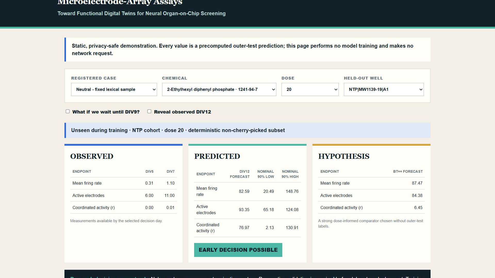
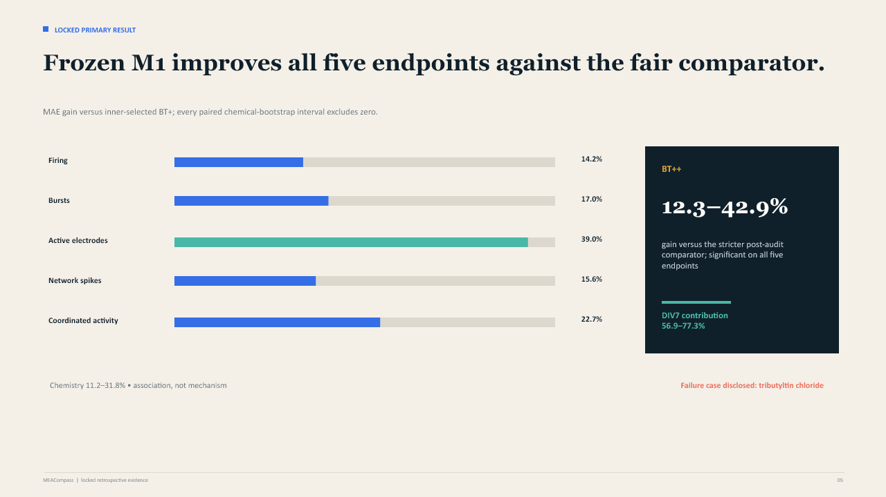
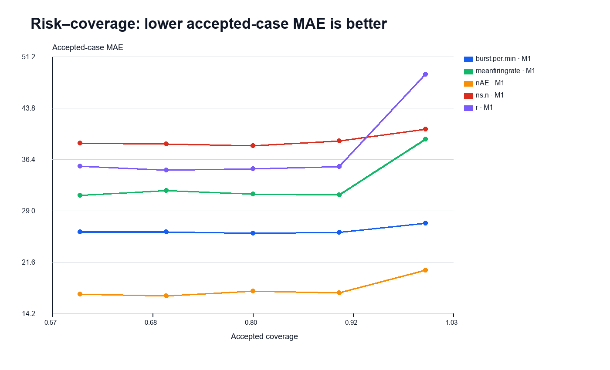

# MEACompass: Reliability-Aware Early Prediction of Neural Network Development from Microelectrode-Array Assays

**Toward Functional Digital Twins for Neural Organ-on-Chip Screening**

**Can DIV7 neural physiology forecast DIV12 outcomes for unseen chemicals—and
know when the forecast is too uncertain to trust?**

MEACompass uses measurements available by day in vitro 7 (DIV7) to forecast
five DIV12 functional outcomes for unseen chemicals. It adds calibrated 90%
intervals and abstains on the least certain 30% of cases.

[Live demo](https://ziyadazzaz.github.io/MEACompass/demo/) ·
[Technical report](https://github.com/ZiyadAzzaz/MEACompass/blob/main/docs/MEACompass_Technical_Report.pdf) ·
[Competition deck](https://github.com/ZiyadAzzaz/MEACompass/blob/main/docs/MEACompass_Competition_Deck.pptx) ·
[Public repository](https://github.com/ZiyadAzzaz/MEACompass)



*Public MEACompass demo — observed early measurements, predicted DIV12 outcome,
calibrated interval, and reliability verdict.*

## Headline evidence

- **14.2–39.0% lower MAE** versus inner-selected BT+ across all five endpoints.
- **12.3–42.9% lower MAE** versus the stricter post-audit BT++ comparator.
- **91.0–92.4% empirical coverage** for nominal 90% prediction intervals.
- Selective prediction passes the registered risk criterion on **3/5 endpoints**;
  the other two remain explicit limitations.

The source is a **rat cortical neural MEA assay, not an organ-on-chip dataset**.
This is a retrospective research decision-support prototype, not an autonomous
assay-termination system. Human neural organ-on-chip transfer requires prospective
external validation.

Author: **Ziyad Azzaz**, College of Artificial Intelligence, Arab Academy for
Science, Technology & Maritime Transport (AASTMT), Alamein Campus, Egypt. Team:
**MEACompass** — solo submission; no additional team members.

## Locked result and limitations



*Locked chemical-disjoint primary result.*

- M1 improves MAE versus inner-selected BT+ by 14.2–39.0% on all five endpoints;
  every chemical-bootstrap paired interval excludes zero.
- Against the stricter post-audit BT++, gains are 12.3–42.9% and remain significant
  on all five endpoints.
- Nested group CV+ attains 91.0–92.4% empirical coverage at nominal 90%.
- At 70% retained coverage, abstention clears the registered 15% risk-reduction
  criterion for firing rate, active electrodes, and coordinated activity. Bursts
  and network spikes are explicit limitations.
- The registered permutation gate originally stopped. A bounded integrity audit
  found no leakage, produced a clean full-shuffle result, and separated real M1
  from 20 independent chemical-block null runs. The failed gate remains recorded.
- Gate L1 is **LOCK**: the model, reliability protocol, and claims are frozen.
- Post-lock F3b refinement evaluation was **CUT before scoring**: two required
  inputs were absent and `r` failed the registered compatibility threshold.
  No external-performance claim is made.

Dose/cohort subgroup results are deliberately narrower than the aggregate claim.
Firing-rate confidence intervals cross zero at low and mid dose and in ToxCast;
the network-spike interval crosses zero at low dose. At zero dose, M1 is worse
than BT+ by point estimate for bursts, firing rate, and network spikes. One
interpretation is that control normalization makes simple baselines competitive
there; this is not established as a causal explanation. The intended early-triage
use is exposed wells.



*Frozen risk–coverage behavior. Lower accepted-case MAE is better; the registered
decision passes three of five endpoints, not five of five.*

Read the integrated [report](docs/report_draft.md), [integrity audit](docs/integrity_audit.md),
[defense Q&A](docs/defense_qa.md), [video script](docs/video_script.md), and
[competition deck outline](docs/slides_outline.md).

## Reproduce without retraining

```bash
make setup
make fetch-results
make test
make reproduce-lite
make demo
make static-demo
```

`reproduce-lite` validates the frozen prediction schema and regenerates tables and
figures from saved result artifacts only. It never launches training and fails
explicitly if required files are missing. The Streamlit demo likewise uses only
precomputed held-out predictions.

For hosting without a Python server, `make static-demo` rebuilds the self-contained
[`docs/demo/index.html`](docs/demo/index.html) fallback. It embeds a deterministic,
cohort-balanced subset of the same precomputed outer-test predictions and makes no
network request. The verified public repository is
[github.com/ZiyadAzzaz/MEACompass](https://github.com/ZiyadAzzaz/MEACompass), and
the live static demo is available at
[ziyadazzaz.github.io/MEACompass/demo/](https://ziyadazzaz.github.io/MEACompass/demo/).

The seven required result/demo files total 8.34 MiB and are committed with a
SHA-256 manifest, so `make fetch-results` is an offline integrity check rather
than a network download. To rebuild from the official EPA source instead:

```bash
make data
make train-all CONFIRM_LOCKED_REBUILD=1
```

`make data` uses only the four public EPA files listed in the official catalog
and verifies the audit SHA-256 values before extraction. `train-all` is guarded
because it regenerates locked results and is not part of the lightweight path.
See `docs/reproducibility.md` for the fresh-clone test and recorded runtime scope.

## Evidence map

- Data provenance and license: `docs/meacompass_data_audit.md`
- Preregistration and append-only decisions: `docs/preregistration.md`,
  `docs/decisions.md`
- Main and stricter comparator results: `results/gate_s_main.csv`,
  `results/bt_plus_plus.csv`
- Integrity controls: `results/audit/`
- Calibration and selective risk: `results/m2_calibration.csv`,
  `results/m3_risk_coverage.csv`
- Time and practical analysis: `results/time_ablation.csv`,
  `results/practical_value.csv`
- Interpretation and cases: `results/feature_importance.csv`,
  `results/case_studies.csv`
- Sources and licenses: `docs/sources_and_licenses.md`
- Final AI-tool disclosure: `docs/ai_tool_disclosure.md`

## Use on your own MEA data

Start with [`schemas/mea_input_v1.yaml`](schemas/mea_input_v1.yaml) and the
[`local adaptation recipe`](docs/adoption_recipe.md). They define a fail-closed
mapping, same-plate zero-dose normalization, chemical-disjoint evaluation,
training-only calibration, drift checks, and prospective validation.

This is a local evaluation/adaptation toolkit, not evidence that the frozen EPA
model can be deployed directly on a new chip. New platforms require local model
training, interval recalibration, and prospective human-reviewed validation.

## License

Project code is Apache-2.0. EPA data are not redistributed through Git and retain
the terms linked from the data audit.

## AI-tool disclosure

Codex/the repository coding agent assisted with implementation, experiment
execution, testing, reproducibility, result artifacts, documentation, the deck,
and subtitles. ChatGPT assisted with planning, strategy, protocol/gate and claim
review, prompt drafting, and submission strategy. Claude provided independent
review, source exploration, strategy/protocol feedback, and critique. Claude and
generated prose were not sources of scientific result values. Every number came
from executed code and saved artifacts; automated claim tests were used, and the
author manually reviewed all public-facing scientific claims and materials. See
[`docs/ai_tool_disclosure.md`](docs/ai_tool_disclosure.md).
