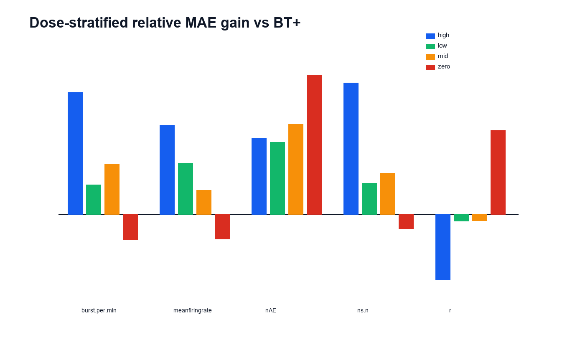
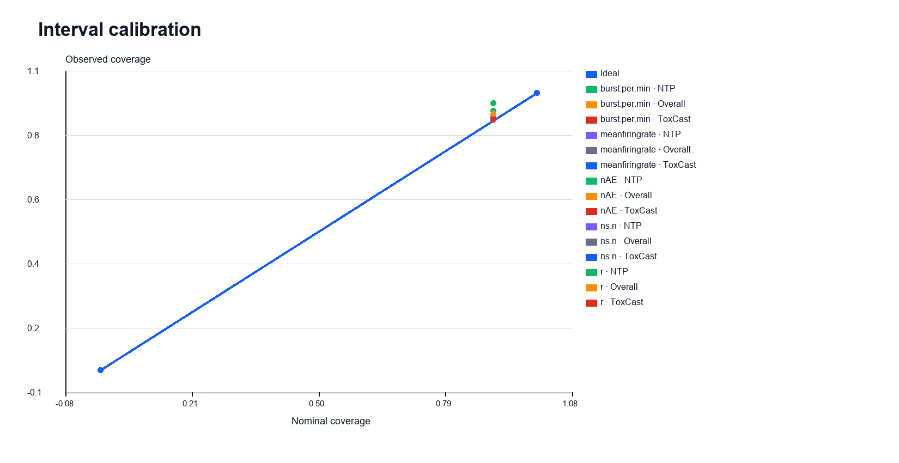
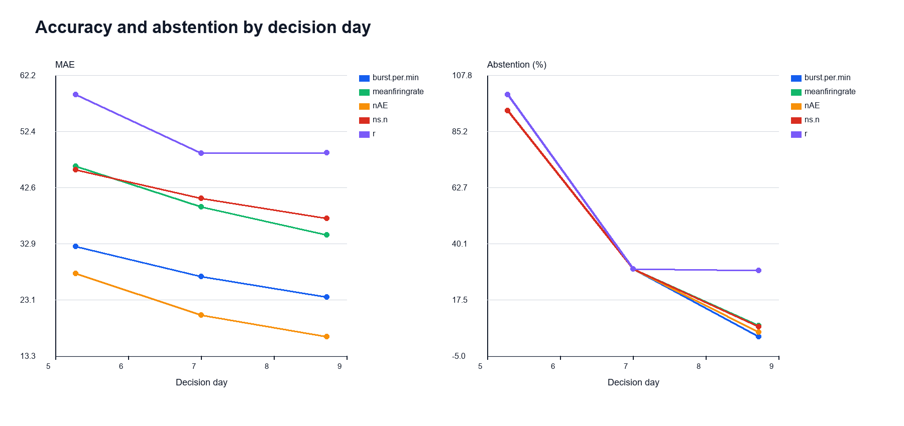

# MEACompass: Reliability-Aware Early Prediction of Neural Network Development from Microelectrode-Array Assays

**Toward Functional Digital Twins for Neural Organ-on-Chip Screening**

## Team information

**Team name, members, and affiliations:** USER CONFIRMATION REQUIRED.

This field will be replaced only from the team's direct confirmation before final
publication; identity is not guessed.

## Abstract

Late functional readouts slow developmental-neurotoxicity triage. MEACompass
forecasts day-in-vitro 12 (DIV12) neural microelectrode-array outcomes from
information available by DIV7, attaches a calibrated interval, and abstains on
the least certain 30% of cases. Evaluation is chemical-disjoint: all doses,
wells, and replicates of a chemical remain together across three repetitions of
five outer folds. On five preregistered endpoints, the frozen model reduced mean
absolute error by 14.2–39.0% relative to BT+, a strong baseline chosen by inner
validation only; all chemical-bootstrap 95% confidence intervals for paired
error differences excluded zero. Against the stricter post-audit BT++ comparator,
the corresponding improvement was 12.3–42.9%, again significant on all five
endpoints. Nested group CV+ achieved 91.0–92.4% empirical coverage for nominal
90% intervals. At 70% retained coverage, error fell materially for firing rate
(39.29 to 31.87), active electrodes (20.42 to 16.75), and coordinated activity
(48.61 to 34.81), while burst and network-spike reductions did not reach the
registered 15% threshold. An initially positive permutation control triggered a
registered stop; a bounded integrity audit found no feature leakage, showed a
clean full-shuffle control, and separated the real model from 20 independent
chemical-block null runs. The resulting prototype is a research decision-support
system, not an autonomous assay-termination system. The source is a rat cortical
neural MEA assay—not an organ-on-chip dataset—and prospective human neural
organ-on-chip validation remains required.

## 1. Problem and importance

Developmental-neurotoxicity studies follow the maturation of neural cultures over
multiple days. Waiting until DIV12 provides the endpoint but delays triage. The
useful question is therefore not merely whether DIV12 can be fitted retrospectively,
but whether an unseen chemical can be forecast using only information already
available by DIV7, whether the forecast beats strong dose- and time-informed
comparators, and whether the system knows when not to predict.

MEACompass is a research prototype for that question. It forecasts five
functional endpoints as percent of same-plate, same-DIV zero-dose control:

- mean firing rate;
- bursts per minute;
- number of active electrodes (`nAE`);
- number of network spikes (`ns.n`); and
- coordinated activity (`r`).

The interface distinguishes **OBSERVED** early measurements, **PREDICTED** DIV12
values and intervals, and **HYPOTHESIS** statements about later or external use.
It never makes an autonomous assay-termination decision. A wide interval produces
an abstention recommendation and the assay continues.

Developmental neurotoxicity is difficult to study because neural-network
formation is dynamic and functional disturbances can emerge over multiple days.
The EPA Network Formation Assay is a new approach methodology that uses
microelectrode arrays to follow activity in cortical cultures. Earlier reliable
forecasts could prioritize review and allocate confirmatory measurements. They do
not replace the final readout, toxicological interpretation, or human oversight.

## 2. Related work

Frank et al. established medium-throughput MEA measurements for evaluating
chemical effects on neural network function. Shafer et al. evaluated network
formation across 136 chemicals and several developmental timepoints, providing
the longitudinal basis for this study. EPA and OECD work on the DNT in vitro
testing battery places these assays in a broader new-approach-method framework;
no single assay is a complete developmental-neurotoxicity decision system.
MEACompass addresses a narrower problem: forecasting a later functional
measurement from causally earlier observations while quantifying uncertainty.

Its distinguishing design choices are chemical-disjoint evaluation, strong
time-informed comparators, nested group-aware calibration, a registered negative
control with an auditable stop, and selective prediction. Boosted trees suit this
tabular, small-chemical regime and remain practical across nested group folds.

## 3. Data and audit

### 2.1 Source and scope

The data are from the U.S. EPA Network Formation Assay associated with Shafer et
al. (2019). This is explicitly a **rat cortical neural microelectrode-array assay,
not an organ-on-chip dataset**. Its relevance to neural organ-on-chip work is
methodological: longitudinal electrophysiology and uncertainty-aware early
forecasting can be used in both settings. This study does not demonstrate transfer
to a human, microfluidic, or organ-on-chip platform.

### 2.2 Audited inventory

| Measure | Audited value |
|---|---:|
| Official test entries | 146 |
| Canonical chemicals | 136 |
| Longitudinal records | 17,224 |
| Plates/batches | 99 |
| Plate-well trajectories | 4,344 |
| Complete DIV5/7/9/12 trajectories | 4,192 (96.50%) |
| NTP records | 5,712 |
| ToxCast records | 11,512 |
| Electrophysiology columns available | 18 |
| SMILES resolved | 130/136 (95.59%) |

The stable experimental key is `(cohort, Plate.SN, well)`. Treatment aliases and
biological replicates are canonicalized to CAS RN before splitting. Missing
burst-conditional measurements are retained with explicit missingness indicators.
The full lineage, checksums, exclusions, and limitations are recorded in
`docs/meacompass_data_audit.md`.

### 2.3 Sources and licenses

The EPA catalog provides public access and links the EPA ScienceHub terms for the
original NFA release. A U.S. Government-work rationale under 17 U.S.C. §105 is
applied only when file-level EPA authorship is verified; repository ownership is
not treated as proof for every file. The source carries no warranty, and EPA
names, seals, or logos must not imply endorsement. Project code is Apache-2.0.
Chemical structures were resolved with the public PubChem PUG REST service. Raw
EPA data, external-refinement files, caches, and checkpoints are excluded from Git.

## 4. Preregistered protocol

Primary endpoints, target construction, causal feature contract, group splits,
metrics, chemical bootstrap, baseline grid, interval rules, and gates were frozen
at commit `8671fd84cc48d5b4fc45fe09ee20227cb3d46ac0` before predictive results.
Later decisions are append-only in `docs/decisions.md`; they do not overwrite the
original protocol.

### 4.1 Time causality

Primary inputs contain raw DIV5 and DIV7 measurements and missingness flags,
exposure dose, cohort, and structure-only chemical descriptors. DIV9 is used only
in a declared post-lock time ablation. DIV12 measurements, DIV12 controls as
features, official potency values, hit calls, and late viability measurements are
forbidden. Automated tests fail closed on future-derived feature names.

### 4.2 Chemical-disjoint nested evaluation

The outer design uses five stratified group folds repeated for seeds 0, 1, and 2.
Canonical CAS RN is the group, so every alias, concentration, plate, well, and
replicate for a chemical stays on one side of a split. Three-fold group splits
inside each outer training set choose baselines and hyperparameters. Outer-test
folds are evaluation only. A random well split would leak correlated views of the
same chemical and answer an easier, operationally irrelevant question.

### 4.3 Comparators

- **B0:** dose-bin mean learned from the outer training data.
- **B1/B1b/B2:** preregistered temporal and simple reference baselines.
- **BT:** best of the original preregistered baseline set.
- **BT+:** best of B0/B1/B1b/B2, selected only on inner validation folds. It was
  registered after B0 exposed weakness in the original comparator set.
- **B3:** a simpler gradient-boosted model using early measurements.
- **M1:** frozen gradient-boosted residual model using DIV5, DIV7, dose, cohort,
  RDKit descriptors, and Morgan fingerprints.
- **BT++:** a stricter post-audit comparator selecting between BT+ and a fixed
  dose-smooth baseline on inner folds only. It was required by the integrity audit
  and is reported separately from the preregistered comparisons.

### 4.4 Metrics and uncertainty

The protocol reports DIV12 MAE, RMSE, and Spearman correlation, change-from-DIV7
metrics, paired MAE difference, and relative MAE gain. Confidence intervals use
1,000 resamples of canonical chemical groups. Wells are never bootstrapped as
independent observations. Nested group CV+ constructs nominal 90% intervals from
training-fold residuals without using the outer test labels for calibration.

## 5. Deviations and integrity audit

BT+ was added as a registered deviation after the preregistered baseline set was
found to omit dose-bin mean B0. BT++ was added only after the bounded integrity
audit as a stricter comparison against a fixed dose-smooth model. Both are
selected without outer-test labels. Neither change alters endpoints, splits,
targets, M1 predictions, or the historical Gate S decision.

The registered chemical-group permutation control unexpectedly showed a small but
significant benefit for bursts versus BT+ (paired ΔMAE −0.525; 95% CI −0.969 to
−0.136). Under the registered rule, **Gate S was STOP: suspected leakage or
confounding**. That decision remains in `results/gate_s_decision.json` and was not
rewritten.

A bounded, post-registration audit then tested feature lineage, prediction-target
alignment, a full target shuffle, a dose-smooth explanation, and 20 independent
chemical-block null runs for B3 and M1 over three seeds and five folds. It found:

- no future-derived or target-derived feature path;
- a clean full-shuffle negative control;
- no prediction/target re-alignment defect;
- generic dose and early-trajectory structure in the original block permutation;
- real M1 performance better than the dose-smooth comparator on all five endpoints,
  with chemical-bootstrap intervals excluding zero; and
- real M1 performance exceeding every one of the 20 M1 block-null runs on every
  endpoint (empirical one-sided p < 0.05 at the available resolution).

The audit conclusion was `PASS_RESIDUAL_STRUCTURE_UNDER_NULL`, conditional on use
of BT++ and retention of the original failed Gate S record. This is a registered
audit resolution, not evidence that the initial control was irrelevant.

## 6. Methods

Each plate-well trajectory is joined across DIV5, DIV7, and DIV12, then normalized
to its same-plate, same-DIV zero-dose control. M1 uses DIV5 and DIV7 neural
measurements, missingness flags, log-transformed dose, cohort, 16 RDKit
physicochemical descriptors, a 2,048-bit Morgan fingerprint, and a
structure-missing indicator. Depending on inner validation, a boosted tree either
predicts DIV12 directly or predicts the residual around a temporal baseline.

The registered grid varies tree depth, learning rate, minimum child weight, and
feature subsampling. Early stopping operates only on inner validation data.
Missing measurements are explicit; there is no globally learned imputer or
scaler. Confidence intervals and paired comparisons use chemicals, never wells,
as the independent resampling unit.

## 7. Implementation

The implementation uses Python 3.11 with pinned scientific dependencies. Every
training task writes a prediction checkpoint and tuning record. Fail-closed tests
check time causality, chemical-group disjointness, prediction schemas, identity,
terminology, claims, and result-only reproduction. `make reproduce-lite` reads
saved evidence only and cannot import a training entry point.

The demonstration consumes the versioned prediction schema and precomputed
held-out predictions. It separates early observations, a prediction and interval,
and research hypotheses. Its reliability badge renders the frozen abstention
rule; it is not a laboratory instruction.

## 8. Main results

All values below aggregate the repeated chemical-disjoint outer-test predictions.
Negative ΔMAE means M1 is better. Confidence intervals are chemical-level paired
bootstrap intervals.

| Endpoint | M1 MAE | BT+ MAE | Gain vs BT+ | ΔMAE vs BT+ (95% CI) | BT++ MAE | Gain vs BT++ | ΔMAE vs BT++ (95% CI) |
|---|---:|---:|---:|---:|---:|---:|---:|
| Bursts/min | 27.17 | 32.74 | 17.0% | −5.57 [−7.51, −3.77] | 32.42 | 16.2% | −5.25 [−7.26, −3.41] |
| Mean firing rate | 39.29 | 45.79 | 14.2% | −6.50 [−11.59, −1.50] | 44.79 | 12.3% | −5.49 [−10.48, −0.21] |
| Active electrodes | 20.42 | 33.50 | 39.0% | −13.08 [−17.47, −9.52] | 35.75 | 42.9% | −15.33 [−25.82, −7.75] |
| Network spikes | 40.72 | 48.26 | 15.6% | −7.54 [−10.20, −4.56] | 47.47 | 14.2% | −6.75 [−9.48, −3.76] |
| Coordinated activity `r` | 48.61 | 62.91 | 22.7% | −14.30 [−17.56, −11.05] | 66.03 | 26.4% | −17.41 [−24.51, −12.32] |

M1 significantly beats both BT+ and BT++ on all five endpoints. This is the fair
primary claim. Relative gains versus the weaker original BT were 18.3–40.6% and
remain available in `results/gate_s_main.csv`, but are not used as the headline.

M1 also improved over B3 significantly for active electrodes and coordinated
activity; the M1–B3 intervals crossed zero for the other three endpoints. Thus the
chemistry-augmented model is not claimed to dominate the simpler model everywhere.

### 8.1 Dose and cohort robustness

Dose cut points were learned on each outer training fold and applied unchanged to
its test fold. At low and mid dose, all five endpoints had beneficial point
estimates versus BT+. The confidence intervals were more selective: bursts,
active electrodes, and coordinated activity excluded zero at low dose; bursts,
active electrodes, network spikes, and coordinated activity excluded zero at mid
dose. Firing-rate intervals crossed zero at both low and mid dose, and the
network-spike interval crossed zero at low dose. The result is therefore not
high-dose-only, but neither is every low/mid subgroup conclusive.

At zero dose, M1 was worse than BT+ by point estimate for bursts (−11.5% relative
gain), firing rate (−23.7%), and network spikes (−8.2%). The bursts and
network-spike paired intervals excluded zero in the harmful direction; the firing
interval crossed zero. Active electrodes and coordinated activity remained
beneficial. **Interpretation:** because the target is percent of matched zero-dose
control, simple control-centered baselines may be especially competitive in
zero-dose wells. This interpretation is not an established causal explanation.
The intended early-triage use is exposed wells, while all zero-dose observations
remain visible in the evaluation.

In descriptive cohort slices, M1 had beneficial point estimates versus BT+ for
all five endpoints in both NTP and ToxCast. Confidence intervals excluded zero for
all five NTP endpoints and four of five ToxCast endpoints; the ToxCast firing-rate
interval crossed zero despite a 13.8% point-estimate gain. These are within-study
subgroup results, not held-out cohort transfer and not external laboratory or
device validation.



## 9. Calibration

Nested group CV+ passed Gate M2 without switching to conformalized quantile
regression. Empirical coverage for nominal 90% intervals was 91.03–92.40% overall;
the lowest separate NTP/ToxCast coverage was 90.36%.



Coverage is reported with interval width because a trivially wide interval is not
operationally useful. These retrospective intervals require local recalibration
under a platform or population shift.

## 10. Selective prediction / abstention

At 70% retained coverage, the registered M3 requirement was at least 15% risk
reduction with a chemical-bootstrap confidence interval below zero:

| Endpoint | Full MAE | Accepted MAE | Risk reduction | Gate M3 |
|---|---:|---:|---:|---|
| Bursts/min | 27.17 | 25.92 | 4.6% | Limitation: below 15% |
| Mean firing rate | 39.29 | 31.87 | 18.9% | Pass |
| Active electrodes | 20.42 | 16.75 | 18.0% | Pass |
| Network spikes | 40.72 | 38.58 | 5.3% | Limitation: CI crosses zero |
| Coordinated activity `r` | 48.61 | 34.81 | 28.4% | Pass, normalization caveat |

M3 therefore passed on three of five endpoints. Bursts and network spikes are
reported as limitations rather than omitted. The `r` result is also qualified:
percent-control normalization has an extreme tail when the plate-control
denominator is near zero.


## 11. Time ablation

The frozen DIV5-only model is substantially weaker than DIV5+DIV7. DIV9 was run
only after L1 lock and is an ablation, not a primary result.

| Endpoint | DIV5 MAE | DIV5+7 MAE | DIV5+7 gain vs BT+ | DIV5+7+9 MAE |
|---|---:|---:|---:|---:|
| Bursts/min | 32.39 | 27.17 | 17.0% | 23.58 |
| Mean firing rate | 46.36 | 39.29 | 14.2% | 34.41 |
| Active electrodes | 27.66 | 20.42 | 39.0% | 16.67 |
| Network spikes | 45.78 | 40.72 | 15.6% | 37.28 |
| Coordinated activity `r` | 58.83 | 48.61 | 22.7% | 48.74 |



## 12. Practical value

DIV7 forecasts are available five days before the DIV12 endpoint for accepted
cases. With the declared 70% policy, approximately 70% of retrospective held-out
instances receive a forecast rather than an abstention. These are time quantities
only—no monetary saving is claimed—and prospective workflow validation is
required. A forecast can support prioritization but does not conclude the assay.

## 13. Interpretability

Exact XGBoost contribution values (`pred_contribs`, a TreeSHAP-style additive
decomposition) were computed for the 25 frozen seed-0 outer models. DIV7 neural
features accounted for 56.9–77.3% of mean absolute contribution, depending on the
endpoint. Combined structure features accounted for 11.2–31.8%; DIV5 contributed
3.7–17.6%. Dose and cohort contributions were generally small. This supports the
interpretation that late-early physiology drives the forecast while chemistry
adds complementary context; it does not establish causal mechanisms.

Five case studies were selected after lock by a disclosed endpoint-scaled error
rule: three low-error examples (Fluorene, Glycerol, Picoxystrobin) and two
high-error failures (Tributyltin chloride, Mercuric chloride). They are descriptive
and are not used to estimate generalization.

## 14. External validation and cohort-shift robustness

F3b external refinement scoring was CUT before data acquisition. The six declared
EPA files passed the amended file-level provenance rule, but the exact serialized
historical outer-fold models required for a genuinely frozen ensemble were not
available. Refitting would violate the registered definition. No external
refinement file was downloaded, harmonized, or scored.

The registered fallback held out each 2019 screening cohort in turn, excluded 11
chemicals shared with the source cohort, and used fixed hyperparameters with no
target-cohort tuning. M1 significantly beat source-selected BT++ on all five
endpoints in both directions. Gains were 10.3–34.5% for ToxCast→NTP and
15.1–50.3% for NTP→ToxCast; every paired chemical-bootstrap interval was below
zero. This supports the narrow conclusion: **retained predictive value under a
held-out NTP↔ToxCast cohort shift without model retuning.** It is not external
laboratory/device transfer and does not replace the locked headline.

## 15. Adoption path for neural organ-on-chip research

MEACompass provides an evaluation and adaptation workflow that can be retrained,
recalibrated, and prospectively validated on a laboratory's own longitudinal MEA
dataset. It is not evidence that the frozen EPA model can be deployed directly on
a new chip.

A responsible adaptation maps local electrodes, activity features, timepoints,
controls, and missingness to an explicit schema. Control normalization is checked
for stability. Chemical- or intervention-disjoint splits reflect intended use,
with all replicates grouped. The model is trained locally, intervals are calibrated
only on local development data, and coverage is audited across batches, devices,
cell donors, and exposure ranges. Drift triggers recalibration or abstention. A
prospective study with predeclared criteria and human review is required before
operational use.

## 16. Limitations

- The study is retrospective and covers 125–136 chemical groups by endpoint.
- Rat cortical culture biology cannot establish human neural organ-on-chip transfer.
- NTP/ToxCast subgroup results are descriptive because cohorts were not external
  held-out domains.
- `r` percent-control normalization can be unstable near zero denominators.
- Abstention did not reach the registered 15% improvement for bursts or network
  spikes.
- At zero dose, M1 was worse than BT+ by point estimate for bursts, firing rate,
  and network spikes. A control-normalization explanation is interpretation, not
  an established finding; the intended early-triage use is exposed wells.
- Chemistry contributions are predictive associations, not mechanistic evidence;
  M1 did not significantly beat B3 on three endpoints.
- The original Gate S failed. The later audit narrows the suspected mechanism and
  supports continuation, but does not erase the registered stop.
- BT+ and BT++ are transparent post-registration safeguards, not preregistered
  headline comparators.
- A historical B3 tuning-log gap is documented. Held-out predictions were not
  rerun because no validity defect was found.
- The prototype has not been prospectively validated, monitored under deployment
  drift, or approved for laboratory decisions.

## 17. Ethics and compliance

MEACompass is a research decision-support system, not an autonomous
assay-termination system. A low-confidence case continues to DIV12; a
high-confidence forecast remains subject to expert review. The interface labels
observations, predictions, and hypotheses separately to limit automation bias.
No human participant data are used. Raw source data and derived per-well external
files are not redistributed by this repository.

Claims are bounded to rat cortical MEA data. Human relevance, regulatory
acceptance, direct neural organ-on-chip performance, and causal mechanism are
outside the evidence. The project does not imply EPA endorsement. Prospective
validation, governance, drift monitoring, and a human escalation path are
prerequisites for real laboratory use.

## 18. AI-tool disclosure

| Tool | Role | Human verification | Scientific-number source |
|---|---|---|---|
| USER CONFIRMATION REQUIRED | USER CONFIRMATION REQUIRED | Repository tests, source review, and final author review | Executed CSV/JSON result artifacts only |

No AI assistant or service name is inferred. The final disclosure will list only
tools and roles confirmed directly by the team. Human authors remain responsible
for study design, code review, source checking, interpretation, and claims.

## 19. Reproduction

The result-only reproduction path is:

```bash
make setup
make test
make reproduce-lite
make demo
```

`reproduce-lite` reads saved prediction/result files only and never imports a
training entry point. It fails with an explicit artifact list when required files
are missing. The demo loads precomputed held-out predictions and operates offline
after dependencies are installed. The frozen prediction contract is
`schemas/prediction_schema_v1.yaml`.

Key evidence artifacts are:

- `results/gate_s_main.csv` and `results/bt_plus_plus.csv` — fair baseline results;
- `results/audit/` — bounded integrity audit and null controls;
- `results/m2_calibration.csv` — interval calibration;
- `results/m3_risk_coverage.csv` — selective prediction;
- `results/time_ablation.csv` and `results/practical_value.csv` — time analysis;
- `results/potency_summary.csv` — explicitly non-primary potency appendix; and
- `results/feature_importance.csv` and `results/case_studies.csv` — interpretation.

The environment is declared in `environment.yml`; package dependencies are pinned
in `pyproject.toml`. Data acquisition is manifest-driven and verifies hashes. A
clean-clone reproduction has passed tests and the result-only figure pipeline.
Full training remains separate so judges can verify tables and figures without
automatically retraining models.

## 20. Sources and licenses

Project code is Apache-2.0. The original EPA release is referenced by DOI and its
catalog/ScienceHub terms; no raw EPA file is committed. PubChem provides structure
lookups and RDKit computes local deterministic descriptors. The F3b refinement
repository has no detected root license, so only the amended file-level provenance
determination is recorded; no refinement file is redistributed. The file-oriented
record is `docs/sources_and_licenses.md`.

## 21. Conclusion

MEACompass demonstrates a credible retrospective result: DIV7 information can
forecast DIV12 neural MEA endpoints for unseen chemicals more accurately than
strong inner-selected baselines, with nominal 90% intervals that attain coverage
and an abstention mechanism that reduces error materially on three endpoints. Its
strongest contribution is the combination of chemical-disjoint evaluation,
explicit negative-control failure and audit, calibrated uncertainty, and an
honest continuation path for uncertain cases. The correct next scientific step is
a frozen, prospective external validation on human neural organ-on-chip data—not
a claim that the current rat assay model is ready to control a laboratory.

## 22. References

- EPA dataset and DOI: https://doi.org/10.23719/1503191
- Data.gov catalog: https://catalog.data.gov/dataset/data-for-evaluation-of-chemical-effects-on-network-formation-in-cortical-neurons-grown-on-
- Shafer et al. (2019): https://doi.org/10.1093/toxsci/kfz052
- Frank et al. (2017): https://doi.org/10.1016/j.tiv.2017.09.016
- EPA DNT NAM fact sheet: https://www.epa.gov/system/files/documents/2022-10/DNT_Factsheet_10_28_22_Final_1.pdf
- OECD DNT in vitro battery recommendations: https://doi.org/10.1787/91964ef3-en
- EPA ScienceHub license: https://pasteur.epa.gov/license/sciencehub-license.html
- PubChem PUG REST: https://pubchem.ncbi.nlm.nih.gov/docs/pug-rest
- Project license: `LICENSE` (Apache-2.0)

## 23. Appendix A — Endpoint and evidence map

| Endpoint | Gain vs BT+ | Gain vs BT++ | M2 coverage | M3 at 70% |
|---|---:|---:|---:|---|
| Bursts/min | 17.0% | 16.2% | 91.08% | Limitation: 4.6% reduction |
| Mean firing rate | 14.2% | 12.3% | 91.53% | Pass: 18.9% reduction |
| Active electrodes | 39.0% | 42.9% | 92.13% | Pass: 18.0% reduction |
| Network spikes | 15.6% | 14.2% | 91.03% | Limitation: 5.3%, CI crosses zero |
| Coordinated activity `r` | 22.7% | 26.4% | 92.40% | Pass: 28.4%, normalization caveat |

Primary rows trace to `results/main_results.csv`, BT++ rows to
`results/bt_plus_plus.csv`, calibration to `results/m2_calibration.csv`, and
risk–coverage to `results/m3_risk_coverage.csv`. F3 secondary results trace to
`results/f3_cross_cohort/summary.csv`.

### Appendix A.1 Potency target mismatch

Official EPA EC50 values summarize ontogeny area under the curve, whereas this
project predicts DIV12 outcomes. Missing official EC50 values are not zeros. An
exploratory Hill-grid analysis found rank correlations of 0.773–0.868 between
predicted DIV12 curve estimates and available official AUC EC50 values across
54–61 chemicals. Because the targets differ, the result is appendix-only and the
project does not claim to predict official potency five days earlier.

## 24. Appendix B — Registered status ledger

| Gate | Status | Meaning |
|---|---|---|
| Gate S | STOP, preserved | Initial block permutation showed a small bursts benefit |
| Bounded integrity audit | PASS | No leakage; full shuffle clean; separation from 20 null runs |
| M1 | PASS | Five-endpoint locked point-prediction result |
| M2 | PASS | Nominal 90% coverage attained for every endpoint |
| M3 | PASS, 3/5 | Passes for firing rate, active electrodes, and `r` |
| L1 | LOCK | Primary model and reliability protocol frozen |
| F3b | CUT | Exact serialized frozen models unavailable; no external data scored |
| F3 | PASS, secondary | Five wins in both chemically disjoint cohort directions |

This ledger preserves failures, deviations, and boundaries alongside positive
results. No appendix result supersedes the locked primary evaluation.
